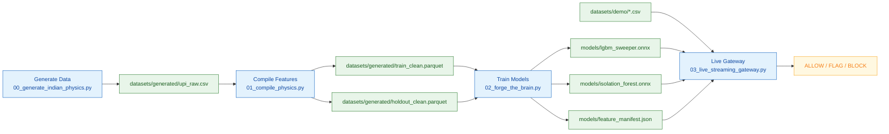

# Varaksha V2 Fraud Intelligence Workspace

This repository is organized for fast onboarding and clear ownership of data, models, services, and UI.

## What this project does

Varaksha V2 builds and serves a fraud-risk pipeline that:

- generates UPI-like transaction data,
- compiles leakage-aware temporal features,
- trains supervised and anomaly models,
- serves live risk verdicts as `ALLOW / FLAG / BLOCK`.

## Top-level directory map

- `datasets/`
  - Source-of-truth dataset root.
  - Contains `demo/`, `generated/`, and `scripts/` with their own README files.
- `varaksha-v2-core/`
  - Active pipeline scripts (`00` to `03`).
- `models/`
  - Central model artifacts and ML documentation.
- `risk-cache/`
  - Rust serving/cache service.
- `services/`
  - Auxiliary graph and agent services.
- `frontend/`
  - Next.js UI for live and narrative views.
- `outputs/`
  - Generated run outputs and report dumps.
- `scripts/`
  - Utility diagnostics.

## End-to-end flow

For a more detailed diagram and architecture notes, see:

- `models/ML_ARCHITECTURE.md`
- `models/ML_LOGIC.md`

## Quick start

1. Build data:
   - `python datasets/scripts/generate_dataset.py`
   - `python datasets/scripts/compile_dataset.py`
2. Train models:
   - `python varaksha-v2-core/02_forge_the_brain.py`
3. Run live simulation:
   - `python varaksha-v2-core/03_live_streaming_gateway.py --csv datasets/demo/real_traffic.csv`

## Notes

- Old `docs/` content was intentionally removed to reduce stale documentation drift.
- Folder-level README files now act as the primary exploration guide.
