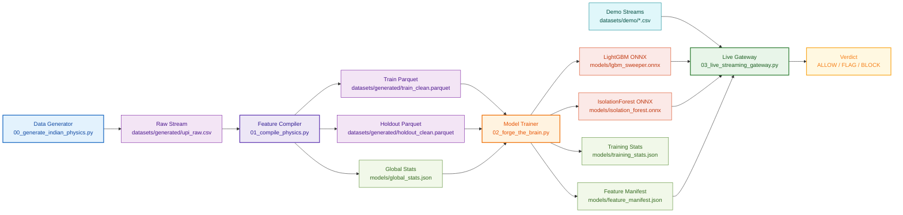

# Varaksha ML Architecture Diagram

This diagram reflects the active V2 flow and uses Mermaid syntax for GitHub markdown rendering.

## Reading the diagram

- Left side: data generation and compilation.
- Center: training and artifact export.
- Right side: live inference and final verdict output.

## Key contract

The `feature_manifest.json` file acts as the serving contract between offline training and online inference.
